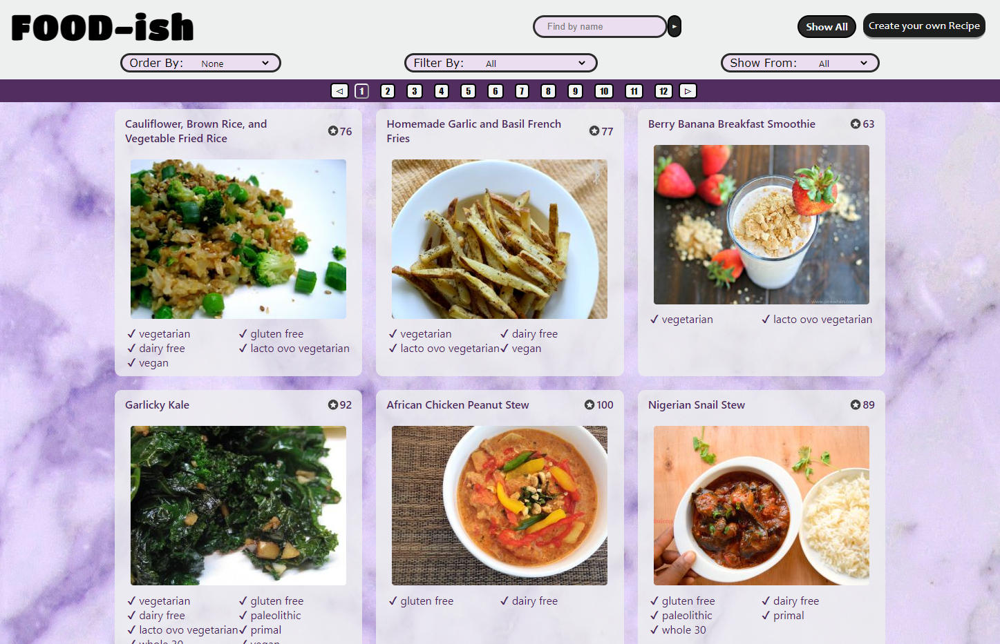

# Individual Project - Food-ish

## Tools

  
   
   
   
   
   
  
  
   
  
  
  

## Feats

* :mag_right: Search by Name of the recipe
* :arrow_up_down: Order by name and HealthPoints
* :clipboard: Filter by type of diet
* :page_facing_up: Create a Recipe
* :eyes: Read a saved Recipe
* :bookmark_tabs: Edit a saved Recipe
* :floppy_disk: Update a edited Recipe
* :skull: Delete a saved Recipe

## Deploy

https://pi-food-1mfp8goxo-rosim24.vercel.app/
